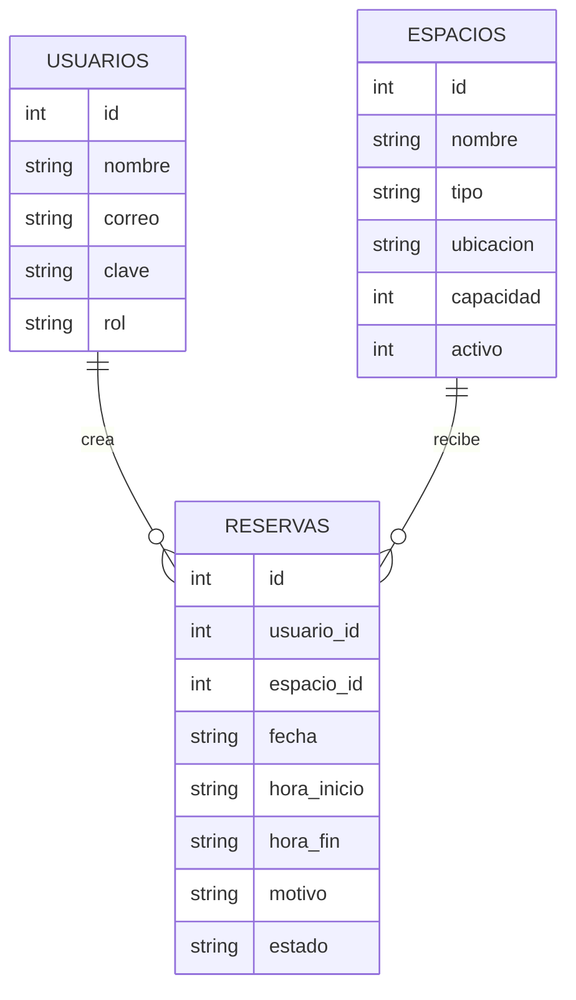

# Diseno del sistema

## Arquitectura propuesta

Se eligio una arquitectura simple de tres capas:

1. Capa de presentacion con wireframes HTML para mostrar la idea visual del sistema.
2. Capa de API REST construida con Node.js y Express.
3. Capa de datos en PostgreSQL con relaciones entre usuarios, espacios y reservas.

Esta estructura permite defender bien la parte de analisis y al mismo tiempo dejar una base tecnica funcional y facil de ampliar. La base principal del proyecto se llama `reservas academicas`.

## Wireframes entregados

Los wireframes estan en la carpeta `public` y se pueden abrir en el navegador al levantar el servidor:

- `http://localhost:3000/login.html`
- `http://localhost:3000/dashboard.html`
- `http://localhost:3000/reserva.html`

### Pantalla 1: Login

Muestra el ingreso al sistema con formulario de correo y clave. Esta pantalla funciona como puerta de entrada obligatoria para que el dashboard y la reserva no puedan verse antes de iniciar sesion.

### Pantalla 2: Dashboard

Resume la ocupacion del dia, accesos rapidos, lista de espacios y reservas recientes para que el usuario tenga una vista general.

### Pantalla 3: Reserva

Presenta el formulario principal para seleccionar espacio, fecha, horario y motivo de la solicitud, junto con una columna lateral de apoyo para ver reglas y disponibilidad.

## Modelo de datos

### Tabla usuarios

- `id`: identificador unico
- `nombre`: nombre del usuario
- `correo`: correo institucional o personal
- `clave`: clave cifrada con hash
- `rol`: tipo de usuario
- `creado_en`: fecha de creacion

### Tabla espacios

- `id`: identificador unico
- `nombre`: nombre del espacio
- `tipo`: salon, laboratorio o auditorio
- `ubicacion`: edificio o sede
- `capacidad`: cantidad maxima de personas
- `activo`: indica si el espacio puede reservarse

### Tabla reservas

- `id`: identificador unico
- `usuario_id`: referencia al usuario que crea la reserva
- `espacio_id`: referencia al espacio reservado
- `fecha`: dia de uso
- `hora_inicio`: hora de inicio
- `hora_fin`: hora final
- `motivo`: descripcion del uso
- `estado`: estado actual de la reserva
- `creado_en`: fecha de creacion

## Relacion entre tablas

## API inicial implementada

1. `POST /api/usuarios` para registrar usuarios.
2. `POST /api/login` para validar el acceso al sistema.
3. `GET /api/espacios` para listar espacios activos.
4. `GET /api/disponibilidad` para consultar espacios libres en una fecha y horario.
5. `GET /api/reservas` para revisar reservas almacenadas.
6. `POST /api/reservas` para crear una reserva validando cruces.

## Validaciones incluidas

1. Campos obligatorios en usuarios y reservas.
2. Formato basico de correo.
3. Formato de fecha y hora.
4. Verificacion de que la hora inicial sea menor a la final.
5. Bloqueo de reservas cruzadas en el mismo espacio y fecha.
6. Validacion de existencia de usuario y espacio antes de reservar.
